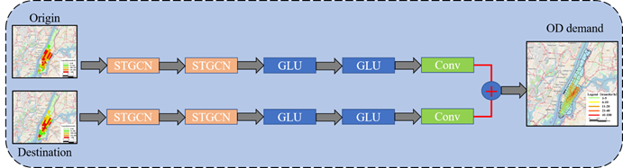
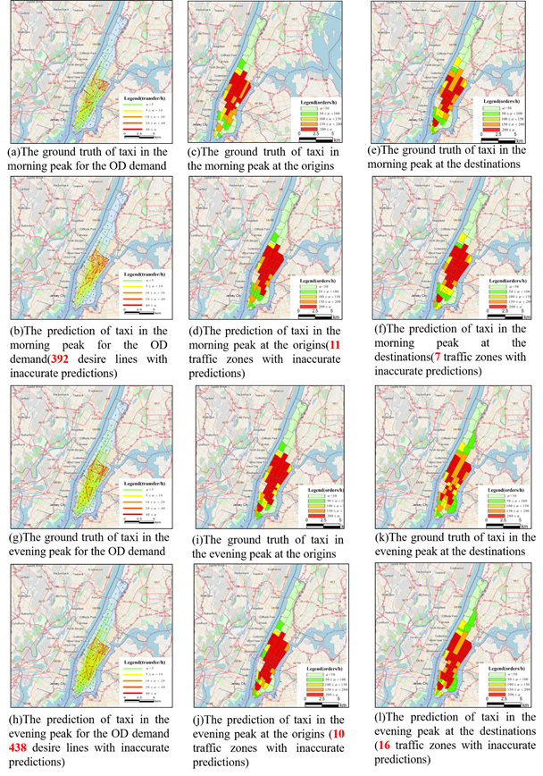

# OD-STGCN
**Spatiotemporal OD prediction based on traffic zones**

## Contents

- [Background](#background)
- [Install](#install)
	- [Dataset](#dataset)
	- [Weight](#weight)
- [Framework](#framework)
- [Training](#training)
- [Testing](#testing)
- [Visualization](#visualization)
- [Contributing](#contributing)
- [License](#license)

## Background

  Timely and accurate forecasting of the spatial transfer of taxis is of great importance for optimizing the efficiency of urban transport operations. However, the following challenges exist in current taxi demand forecasting: (1) The task of traffic forecasting itself possesses complex spatial dependencies and dynamic temporal patterns. (2) Most current studies focus on the static demand for taxis, i.e. the demand at the point of origins while ignoring the modeling of destinations. (3) Previous studies have used gridding to express the overall demand state of urban taxis, which in turn has produced unreasonable boundary grids. To overcome these challenges, we propose a novel deep learning framework called OD-STGCN to predict the OD demand of the urban taxi. The framework characterizes the OD of taxis in the temporal and spatial domains. We use the form of traffic zones to divide the city into areas rather than gridding. A novel nested long and short-term memory neural network(NLSTM) is used to capture the temporal hierarchical structure of long, and A Chebyshev graph neural network(ChebGCN) based on the spectral domain captures the spatial dependence of adjacent zones. Two-way Spatio-temporal feature capture from destination and origin, with integrated output at the end of the frame. Finally, generalization performance validation using the Manhattan in New York taxi public dataset showed that our model outperformed other state-of-the-art models.

## Install

The python version and the core package
```
python==3.6
tensorflow==1.4.0
```
[main.py](main.py) is the main program entry.
### Dataset

Before training, please download train sets, test sets and validation sets  from :
```
https://drive.google.com/drive/folders/1pdnTUIlhuzyw4i3VHpvpSr5MbOQCOCXL?usp=sharing
```
putting the datasets into the [/data_loder](/data_loder)

### Weight
You can download the weight of the detection model from 
```
https://drive.google.com/drive/folders/1xBQ1r-pl7Kc45BP1B1MDn4rqCcy-CrPm?usp=sharing
```

Four weight file ,the `OD_NLSTM_model` is the state-of-the-art model


## Framework

NLSTM is responsible for temporal feature extraction and ChebGCN is responsible for spatial feature extraction. The STGCN module is composed of the two modules, and the OD integrated output is carried out through two Gated Linear Units(GLU).




## Training

In the [main.py](main.py), you can comment out `line 59` and line `60` for retraining.
If you want to change the diffrent models, you can go to the [/models/baes_model.py](/models/baes_model.py) `line 16` to change the time capture module called `tempro_model`, we construct `NLSTM,LSTM,conv+GLU,conv`, we can modify the name as required

## Testing 
Training and testing are separated. Our weight file not only saves the parameters of the model, but also saves the structure of the model, so it is an independent part.

Commentting  `line 58`  and activating `line 59,60`  of the [main.py](main.py) . 
We divide it into single-step prediction and multi-step prediction. It is multi-step prediction when `single_day = False`, and call [utilsod/metrics_utils](utilsod/metrics_utils) function for accuracy evaluation. When `single_day = True`, it is one-step prediction, and the prediction results will be output to `CSV` file.

## Visualization 




## Contributing

Some codes refer to [STGCN](https://github.com/VeritasYin/STGCN_IJCAI-18)

In the time feature capture module, we refer to [NLSTM](https://github.com/hannw/nlstm)

At last, thank you very much for the contribution of the co-author in the article, and also thank my girlfriend for giving me the courage to pursue for a Ph.d.

## License

[MIT](LICENSE) © YanjieWen
